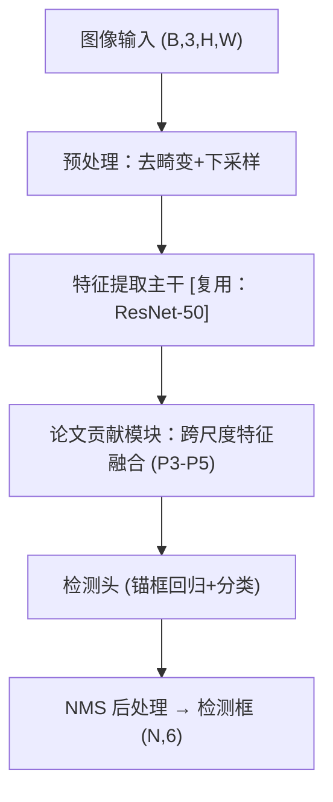

# 领域架构抽象规则（CV / 导航 / 机械）

本文档定义三个领域的"模块抽象范式"与"依赖识别规则"。提炼框架时按论文所属领域选择对应范式，将论文系统映射为通用数据流。核心原则：**剥离硬件参数，保留数据流拓扑**。

## 通用数据流骨架

所有领域共用四级抽象骨架，架构图必须能映射到该骨架：

```
传感器输入 → 预处理 → 核心算法 → 控制/输出
```

- **传感器输入**：抽象为数据类型（图像、点云、IMU 序列、关节角、力/力矩），不写具体型号。
- **预处理**：去畸变、滤波、降采样、特征提取、坐标变换等。
- **核心算法**：论文的主要贡献模块（检测网络、优化器、规划器、控制器、标定算法等）。
- **控制/输出**：位姿估计、轨迹、控制指令、栅格地图、结构参数等。

## 计算机视觉（CV）范式

```
图像/视频输入 → 数据增强与归一化 → 主干网络（Backbone） → 颈部（Neck/FPN）
→ 头部（Head：检测/分割/分类） → 后处理（NMS/解码） → 输出（框/掩码/类别/位姿）
```

**依赖识别要点：**

- 主干网络（ResNet / ViT / Swin 等）与论文贡献模块必须分层标注；论文直接复用的预训练结构标注 `[复用：主干]`。
- 损失函数、训练策略（自监督蒸馏、课程学习等）属于训练期依赖，与推理数据流分开画或用虚线标注。
- 多阶段系统（如两阶段检测、跟踪-by-检测）按阶段拆模块，阶段间标注中间数据格式。

**常见剥离项**：数据集名（COCO、ImageNet）、输入分辨率、批大小、预训练权重来源。

## 导航（Navigation / SLAM / 规划）范式

```
传感器输入（图像/点云/IMU） → 里程计/前端（特征跟踪/配准） → 后端优化（BA/因子图/滤波）
→ 回环检测（可选） → 建图（稠密/稀疏/栅格） → 定位输出
                                          ↘ 全局规划（A*/RRT） → 局部规划（轨迹优化） → 控制指令
```

**依赖识别要点：**

- 前端-后端-回环是 SLAM 标准三分，论文系统按此归位；不具备的模块在报告中说明缺失，不画空节点。
- 传感器融合类论文（VIO / LIO / 多传感器紧耦合）标注各传感器数据进入图优化/滤波器的位置。
- 规划类论文区分全局规划与局部规划/控制两级；端到端导航论文按"感知 → 中间表征（占据栅格/神经场/BEV） → 策略网络 → 控制量"抽象。

**常见剥离项**：数据集与设备型号（KITTI、EuRoC、VLP-16、RealSense）、传感器频率、相机内参、计算平台（Jetson 等）。

## 机械工程（Mechanical / 机器人机构 / 控制）范式

```
物理量输入（力/位移/振动信号/关节状态） → 信号调理（滤波/降噪/归一化）
→ 系统建模（动力学/运动学模型、参数辨识） → 求解/优化（正逆解、数值迭代）
→ 控制律计算（PID/自适应/鲁棒） → 执行器指令 / 性能指标输出
```

**依赖识别要点：**

- 区分"建模假设层"（小扰动线性化、刚体假设、忽略摩擦）与"算法层"；假设属于模块的前置条件，标注在模块说明中。
- 机构学论文（运动学/动力学分析）按"构型描述 → 坐标系约定 → 正逆解 → 数值验证"抽象。
- 含仿真验证的论文，仿真环节（ADAMS、ANSYS、MuJoCo、Isaac）标注 `[验证环境]`，不进入核心数据流。

**常见剥离项**：具体机型型号（UR5e、Franka）、材料参数、样机尺寸、采样频率。

## 架构图输出格式

优先 Mermaid，退化用缩进列表。节点标注输入/输出数据类型，示例：



缩进列表等价形式：

```
- 图像输入 (B,3,H,W)
  - 预处理：去畸变+下采样
    - 特征提取主干 [复用：ResNet-50]
      - 论文贡献模块：跨尺度特征融合 (P3-P5)
        - 检测头（锚框回归+分类）
          - NMS 后处理 → 检测框 (N,6)
```

不确定的连接关系标注 `[未明确]`，禁止臆测填充。
